# Utilizando NLog con MonoDevelop en .NET</title>
		

			Para cualquier aplicación de software a nivel producción es indispensable tener un componente que escriba los eventos más significativos en una bitácora.
			Esta acción que se conoce como logging (escribir en la bitácora) se define técnicamente como:
			

			

				<i>“Una forma sistemática y controlada para obtener el estado de una aplicación en tiempo de ejecución.”</i>
			

			
Pensando en esto, los diseñadores de .NET incorporaron un mecanismo de <b>logging</b> de forma predeterminada  dentro del ensamblado <b>System.Diagnostics</b>, en clases como <i>Trace,</i> <i>TraceListener,</i> <i>Swicth</i>  y todas sus clases derivadas. Aunque el empleo de estas clases es efectivo, no deja de ser rudimentario y carecer de muchas funcionalidades que terminan siendo un límite.

			
Teniendo en cuenta esto, en el ecosistema .NET han surgido a lo largo de los años una cantidad de componentes propietarios y opensource para el logging de aplicaciones. Dentro de ese conjunto hay un componente que se destacado y es del que trataré de resumir en este tutorial: <b>Nlog</b>.

			<h2>¿Qué es NLog?</h2>
			
<b>Nlog</b> <a href="http://nlog-project.org/">(http://nlog-project.org/)</a>  es un componente open source de logging para .NET, que entre sus características se encuentran:
			<ul>
			<li>Muy fácil de configurar.</li>
			<li>Extremadamente personalizable con plantilla (layouts) </li>
			<li>Altamente extensible</li>    
			</ul>

			
Hay tres características que se deben conocer antes de empezar su utilización:
			<ol>
				<li><b>Targets:</b> Se utilizan para enviar los mensajes hacia otro destino, entiéndase aquí un archivo, una base de datos, un email, la consola, un webservice, etc.</li>
				<li><b>Layouts:</b> Con los comandos de layout podemos definir la estructura o el molde de como acomodar la información escrita en un determinado target.</li>
				<li><b>Levels:</b> Es una forma de asignar una prioridad al mensaje, los niveles permitidos son los siguientes:</li>
				<ol>
					<li><b>Fatal:</b> Sucedió algo que causo que el todo el sistema entero falle, se debe detener la ejecución.</li>
					<li><b>Error:</b> Un problema ha ocurrido pero no es fatal, el sistema puede seguir funcionando.</li>
					<li><b>Warn:</b> Un problema ha ocurrido, pero puede ser recuperable.</li>
					<li><b>Info:</b> Mensajes de información muy útiles como cambios de estado, login/logout, etc.</li>
					<li><b>Debug:</b> Se utiliza durante el desarrollo del sistema.</li>
					<li><b>Trace:</b> Para indicar el inicio y final de una rutina.</li>
				</ol>
			</ol>

			
Como un primer acercamiento a su utilización, escribí una aplicación de consola en C# que solicita una cadena de conexión, con esta cadena trata de conectase a una base de datos PostgreSQL, si la cadena de conexión no es correcta se utiliza <b>Nlog</b> para enviar la excepción a consola, si logra conectarse solicita una consulta SELECT para ejecutar y mostrar los resultados en la consola. Aquí de nuevo si ocurre una excepción utiliza <b>Nlog</b> para notificarla.

			<!-- Steps-->
			
1-. Ejecutar <b>Monodevelop</b> y seleccionar un proyecto de consola y nombrarlo como <b>HelloNlog</b>

			
<b>Fig. 1</b> crear un proyecto llamado HelloNlog
 
			

			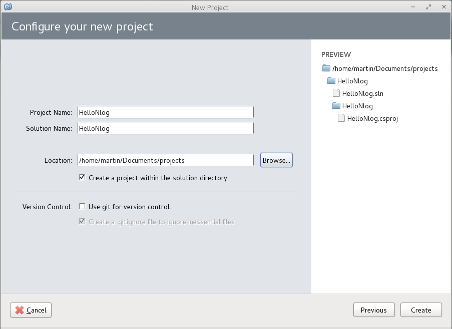

 
			
2-. Dentro del <b>Solution Explorer</b>  has click con el botón derecho y has click en <b>Add Packages</b> , entonces aparecerá la pantalla <b>Add Packages</b>, ya en esa pantalla usa el buscador para encontrar el paquete <b>Nlog</b>, y seleccionar los paquetes: <b>Nlog,</b> <b>Nlog Configuration</b> y <b>Npgsql</b> respectivamente, presionar el botón <b>Add Packages</b> para agregar los ensamblados al proyecto. 

			
<b>Fig. 2</b> seleccionar los paquetes Nlog y Nlog Configuration
 
			

			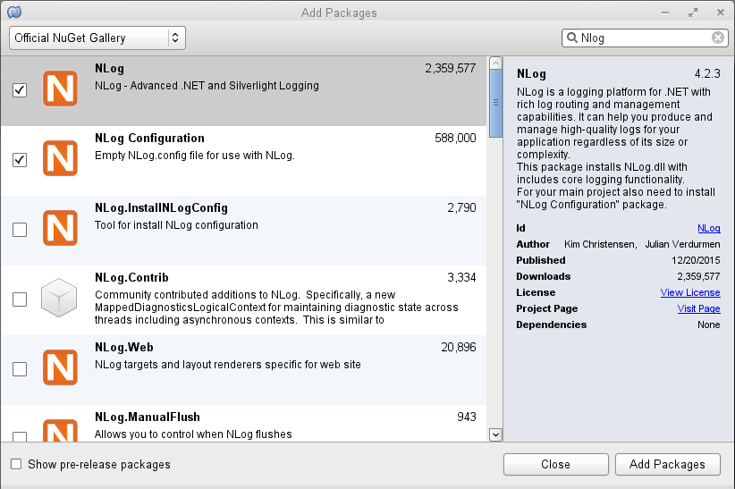

 
			
3-.  Ahora que ya se tiene una estructura en la solución como se muestra en la siguiente imagen:

			
<b>Fig. 3</b> la estructura de la solución con los ensamblados.
 
			

			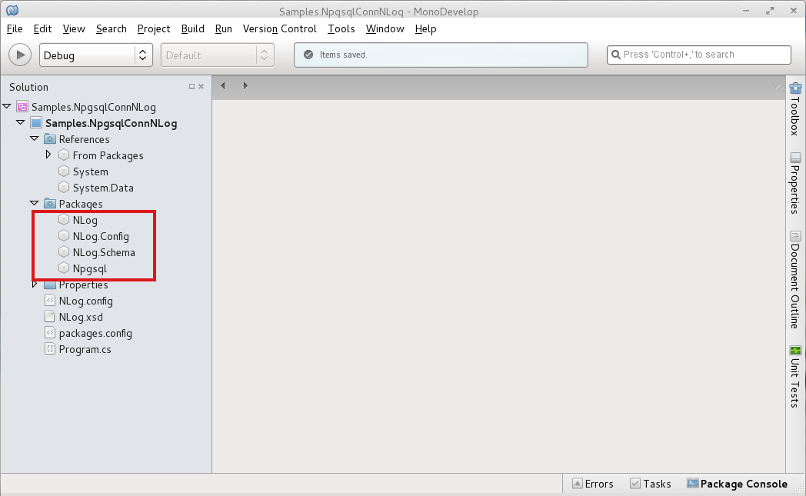

 
			
			
4-. Agregar al proyecto una clase llamada <b>NloggerWrapper</b>

			
5-. Bien ahora hay que completar el  código de la clase <a href="http://sh.st/CDTiJ" target="_blank">Program</a>.

			
			
6-. Antes de ejecutar la solución es muy importante editar el archivo <b>Nlog.conf</b> para agregar <b>targets</b> (objetivos), <b>layouts</b> (disposición)  y <b>rules</b> (reglas). Aquí el código del archivo <b>Nlog.conf</b> del proyecto.

			<!--Code Nlog.conf-->
			

			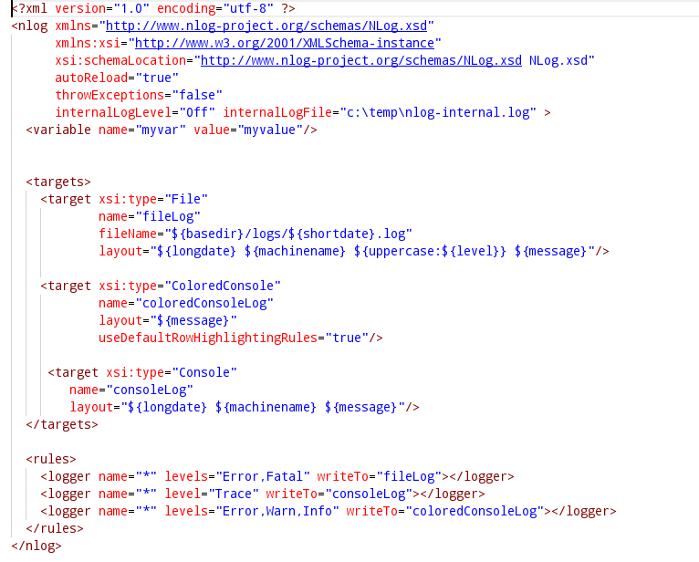

 
			<!--Code Nlog.conf-->
			<h2>Targets</h2>
			
En este archivo de configuración defino tres <b>targets</b>, el primero hacia un archivo, el segundo hacia una consola con salida de color y el último hacia una consola de salida normal.

			<!--Code Targets -->
			

			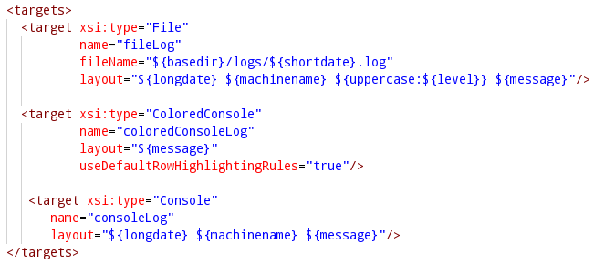

 
			<!--Code targets-->
			
Para ver completa la lista de targets consultar el enlace: <a href="https://github.com/NLog/NLog/wiki/Targets">https://github.com/NLog/NLog/wiki/Targets</a>

			<h2>Layouts</h2>
			
Por cierta comodidad y porque así es la manera predeterminada de ver la información, puse los <b>layouts</b> de la siguiente manera:

			<!--Code layouts-->
			

			

 
			<!--Code layouts-->
			
Se especifica un <b>layout</b> por cada uno de los <b>targets</b> Para más información de los <b>layouts</b> ver el siguiente enlace:  <a href="https://github.com/NLog/NLog/wiki/Layout-Renderers">https://github.com/NLog/NLog/wiki/Layout-Renderers</a>

			<h2>Rules</h2>
			

Ahora la configuración para las rules, aquí con el '*' le indico que ese nivel se use para todos los logs, únicamente en los niveles <b>Error</b> y <b>Fatal</b> escriban hacia el <b>target</b> llamado fileLog que es el <b>target</b> que escribe hacia un archivo de texto, en la segunda regla indico igual que para todos logs, los niveles Trace se escriban hacia el log llamado consoleLog que tiene la salida normal de consola y por último le indico que para los niveles <b>Warn</b> y <b>Info</b> escriban hacia el log de la consola con colores.

			<!--Code Rules-->

			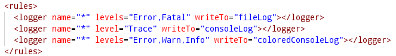

 
			<!--Code rules-->
			
Para más información de las reglas ver el siguiente enlace: <a href="https://github.com/nlog/NLog/wiki/Configuration-file#rules">https://github.com/nlog/NLog/wiki/Configuration-file#rules</a>

			
8-. Antes de ejecutar el programa, en el <b>Solution Explorer</b> haz click derecho sobre la solución después haz click en options, aparecerá la ventana <b>Project Options</b> ahí seleccionar las opciones <b>run on external console</b> y <b>pause console output</b>.

			
<b>Fig. 4</b> opciones para ejecutar el proyecto.
 
			

			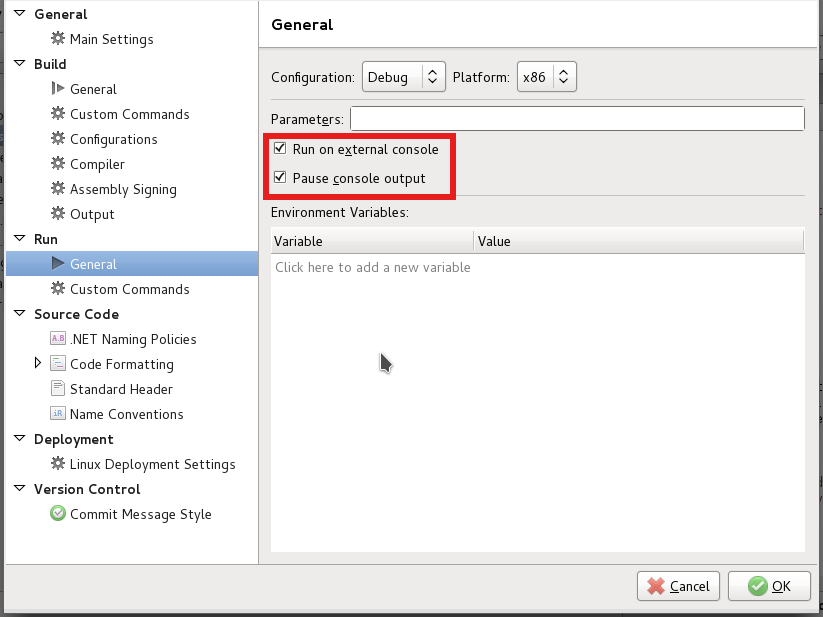

 
			
Bien al ejecutar el programa este solicita una cadena de conexión desde el inicio:

			
<b>Fig. 5</b> el programa solicita una cadena de conexión.
 
			

			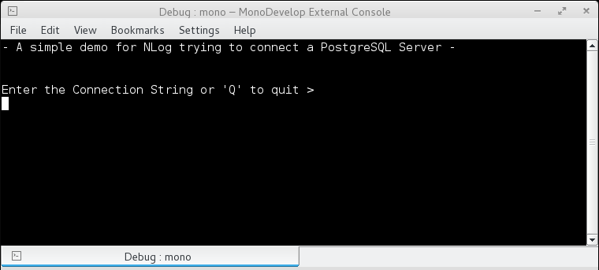

 
			
Errores como si la cadena de conexión no tiene un formato correcto, el servidor <b>Postgresql</b> esta abajo o no existe la base de datos, etc. Son encerrados dentro por un bloque <b>try/catch</b> y enviados al método <b>LogException</b> para que <b>Nlog</b> utilice el level correspondiente y lo mande hacia el target.
			Aquí el código del método LogException dentro de la clase <b>NLoggerWrapper</b>

			<pre>
				public static void LogException(Exception ex)
			  {
			   if (ex is ArgumentException)
				logger.Warn (ex.Message);
			   else
			   if (ex is NpgsqlException)
				logger.Error (ex.Message);
			   else
				logger.Fatal (ex.Message);
			  }
			</pre>
			
En este código dependiendo del tipo de excepción utiliza un nivel (level) de <b>Nlog</b> para escribir.

			
<b>Fig. 6</b> el programa con <b>Nlog</b> muestra las excepciones en la consola con color..
 
			

			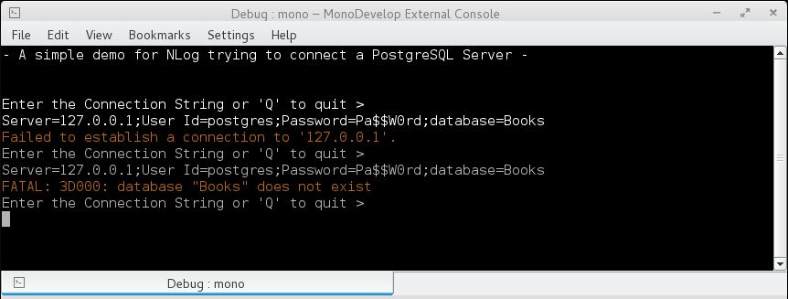

 
			
<b>Fig. 7</b> excepción atrapada por Nlog que se muestra en color.
   
			

			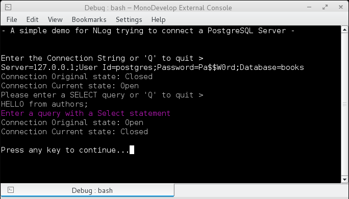

 
			
Cuando  uno de los <b>target</b> como en este ejemplo esta dirigido a escribir en archivo se puede revisar la creación del archivo y posteriormente su contenido.

			
<b>Fig. 8</b>  la creación de los archivos log con el target File.
   
			

			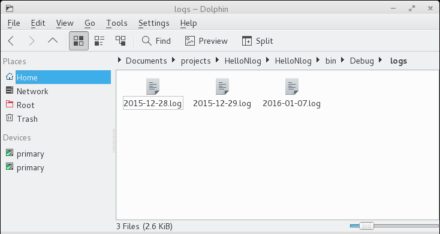

 
			
<b>Fig. 9</b>  el formato de los archivos log.
   
			

			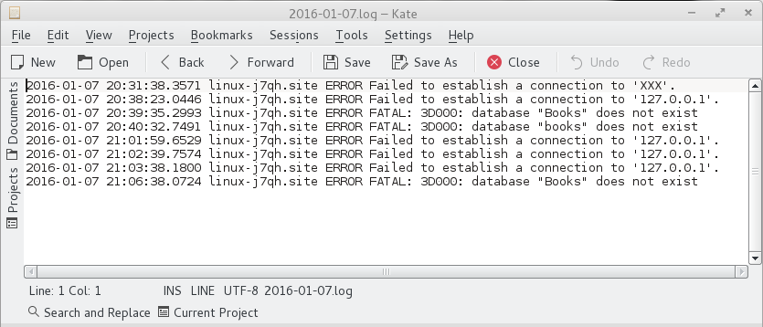

 
			
<b>Fig. 10</b> la ejecucción del programa sin errores
 
			

			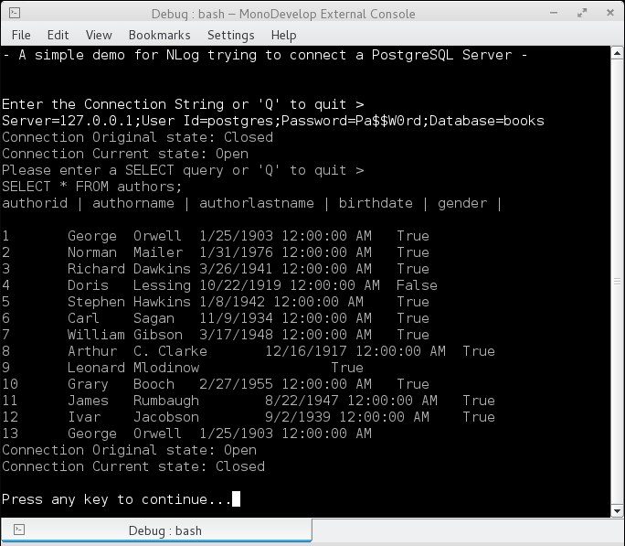

